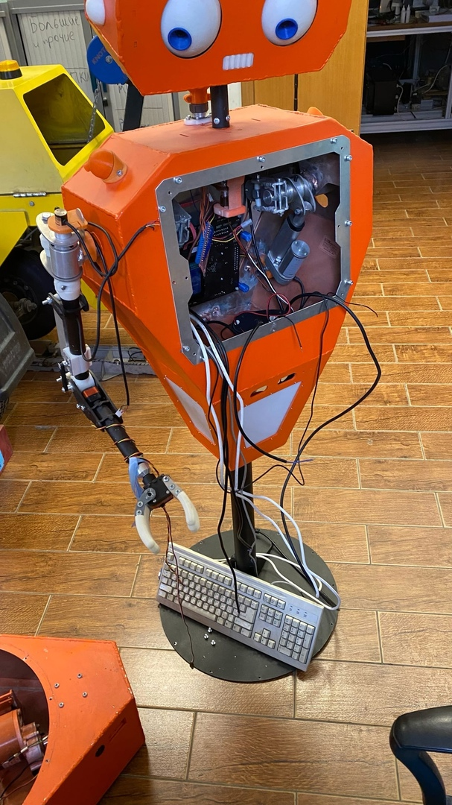
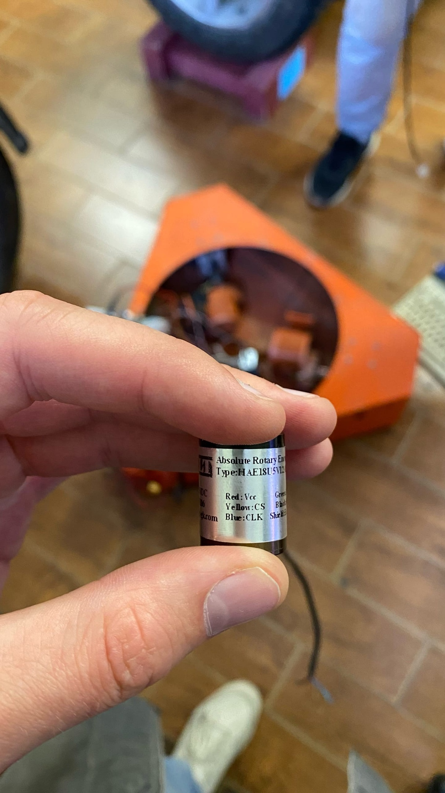
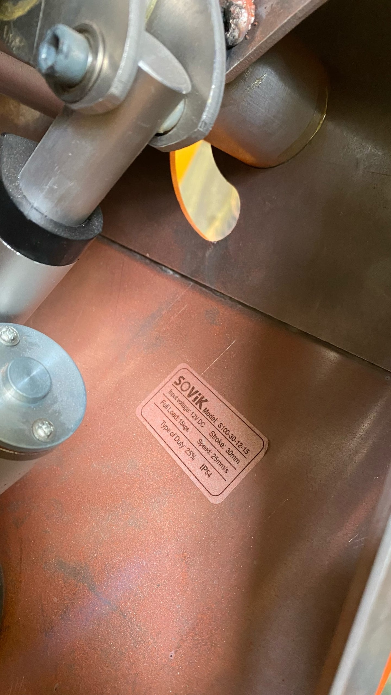

# Части робота
Робот состоит из трех частей: 
- основание; 
- туловище;
- голова.

## Описание периферии нижнего уровня

### Описание основания
Основание состоит из:
- 3 электродвигателя;
    - Номинальное напряжение 12В и мощностью 150Вт (см. папку с фото). Ток удержания (блокировка вращения) достигал значние 20А.
    

Фото

    
    

- 3 оптических энкодера:
    - На диске энкодера 20 засечек, шаг квантования 18 градусов при работе по фронту, 9 градусов при работе по фронту и срезу.
    

Фото

    
    
    

- 3 инфракарсный датчика расстояния **sharp gp2d12** [Ссылка на DS](https://engineering.purdue.edu/ME588/SpecSheets/sharp_gp2d12.pdf);

- 4 ультразвуковых датчика расстояния **jsn-sr04t** [Ссылка на DS](https://www.makerguides.com/wp-content/uploads/2019/02/JSN-SR04T-Datasheet.pdf);

    

Фото

    
    

- uart-приемник 

### Описание туловища 
Туловище состоит из:
- 4 энкодера hae18u5v12a0.5 [Ссылка на DS](https://www.amazon.com/Resolution-Magnetic-Rotary-Encoder-Absolute/dp/B07QJ8S3JM);
    

Фото

    
    
    
    

- 4 серво SRS-3216HTG [Ссылка на DS](https://cdn-global-hk.hobbyking.com/media/file/14371476X1921611X26.pdf);

    - Один серво управляет хватом, второй вращает хват вокруг своей оси. 
    - Возможный ход 270 градусов, с длительностью управляющих импульсов 0.9-2.1мкс. 
    - Серво в кисти имеет механические ограничения. 
    - Допустимы диапазон работы соответствует диапазону импульсов 1.11-1.62мкс. В случае выхода из диапазона ток удержания по даташиту порядка 6А. 
    > ⚠️ В одной из рук не работает серво в локте, возможно механически заблокирован.
    

Фото

    
    

- 2 привода линейного перемещения;
    - Привод установлен на плече робота. Отвечает за поднятие предплечья. 
    - Номинальное напряжение 12В.
    - Ток без нагрузки 0.7А, с нагрузкой в 3.140 кг. ток - 2.4А.
    - При последниех замерах уходил в насыщение по току - 1.4А и уже не мог поднять груз.

    

Фото

    
    

- 4 двигателя **s150106xd88**;
    - Приводы стоят внутри робота. 
    - Один отвечает за поворот плеча, другой за поднятие руки.
    - Номинальное напряжение 12В. 
    - Ток без нагрузки 0.8А, с нагрузкой в 3.140 кг. ток - 1.4А. 
    - Ток удержания (блокировка вращения) достигал значние 7А.
    
    

Фото

    
    

### Описание головы 
Голова состоит из:
- 4 серво **HXT900HEXTRONIK** [Ссылка на DS](http://electronics.inf.ua/P36.files/Hextronik_HXT900.pdf);
    

Фото

    
    

- 1 серво **h king hk15138** [Ссылка на DS](http://www.agspecinfo.com/pdfs/H/HK15138.PDF);

## Описание периферии верхнего уровня
