 - 
 - 
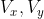 - 
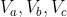 - 
 - 

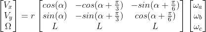 - <a href="https://www.codecogs.com/eqnedit.php?latex=\begin{bmatrix}V_{x}\\V_{y}&space;\\&space;\Omega\end{bmatrix}&space;=r&space;\begin{bmatrix}cos(&space;\alpha&space;)&-cos(&space;\alpha&plus;&space;\frac{&space;\pi&space;}{3}&space;)&-sin(&space;\alpha&plus;&space;\frac{&space;\pi&space;}{6})&space;\\sin(&space;\alpha)&space;&-sin(&space;\alpha&plus;&space;\frac{&space;\pi&space;}{3}&space;)&cos(&space;\alpha&plus;&space;\frac{&space;\pi&space;}{6}&space;)\\L&L&L\end{bmatrix}&space;\begin{bmatrix}\omega_{a}\\\omega_{b}&space;\\&space;\omega_{c}\end{bmatrix}" target="_blank"></a>

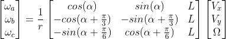 - <a href="https://www.codecogs.com/eqnedit.php?latex=\begin{bmatrix}\omega_{a}\\\omega_{b}&space;\\&space;\omega_{c}\end{bmatrix}&space;=&space;\frac{1}{r}&space;\begin{bmatrix}cos(&space;\alpha&space;)&sin(&space;\alpha&space;)&L&space;\\&space;-cos(&space;\alpha&plus;&space;\frac{&space;\pi&space;}{3}&space;)&-sin(&space;\alpha&plus;&space;\frac{&space;\pi&space;}{3}&space;)&L&space;\\&space;-sin(&space;\alpha&plus;&space;\frac{&space;\pi&space;}{6}&space;)&cos(&space;\alpha&plus;&space;\frac{&space;\pi&space;}{6}&space;)&L&space;\end{bmatrix}&space;\begin{bmatrix}V_{x}\\V_{y}&space;\\&space;\Omega\end{bmatrix}" target="_blank"></a>

 - 

 - 

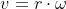 - 

 - 

 - 

 - 

 - 

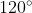 - 

 - 

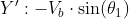 - 

 - 

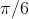 - 

 - 

 - 

 - 

 - 

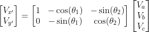 - 

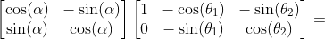 - 

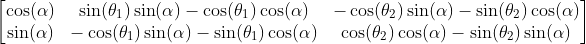 - 

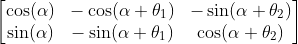 - 

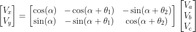 - 

 - 

 - 

 - 

 - 

 - <a href="https://www.codecogs.com/eqnedit.php?latex=\begin{bmatrix}\omega_{a}\\\omega_{b}&space;\\&space;\omega_{c}\end{bmatrix}&space;=&space;\frac{1}{r}&space;\begin{bmatrix}\cos(&space;\alpha&space;)&\sin(&space;\alpha&space;)&L&space;\\&space;-\cos(&space;\alpha&plus;&space;\theta&space;_{1})&-\sin(&space;\alpha&plus;&space;\theta&space;_{1})&L&space;\\&space;-\sin(&space;\alpha&plus;&space;\theta&space;_{2})&\cos(&space;\alpha&plus;&space;\theta&space;_{2})&L&space;\end{bmatrix}&space;\begin{bmatrix}V_{x}\\V_{y}\\\Omega\end{bmatrix}" target="_blank"></a>

