

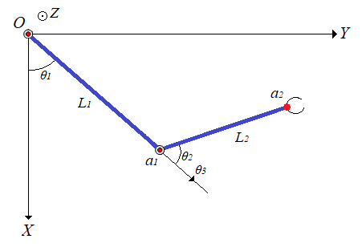

Обозначения и значения параметров

Значение параметров взяты [отсюда](https://github.com/lsd-maddrive/mishanya-bot-project/blob/develop/docs/kinematics/dimensions.md)

| Обозначение| Смысл| Значение, ед. изм.|
| -------------------|:---------------:| ---------:|
| *X,Y,Z / x,y,z*      | абсолютные координаты | м |
| *X',Y',Z' / x',y',z',X'',Y'',Z'' / x'',y'',z''*      | преобразованные координаты      |   м |
| , 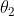,  | углы поворота звеньев манипулятора      |    рад |
| *L1*      | Длина первого звена | 0.258 м |
|   *L2*   | Длина второго звена | 0.236 м |

Прямая кинематика:

Обратная кинематика:

Для начала введём несколько обозначений:
,  ,  , 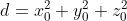 , где  - координаты желаемой точки.
Далее обозначим:
###

###

###

 или 

Окончательно:

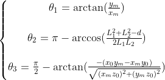

###

Вывод уравнений

Для прямой кинематики:

Для начала отметим, что точки a1 и a2 всегда лежат в одной плоскости, которую мы будем называть плоскостью манипулятора. Внутри этой плоскости они однозначно связаны через угол , поэтому сразу вычислим эту связь.

Первое звено L1 закреплёно одним концом на плече в точки О и поворачивается на угол ,
второе звено L2 крепится к концу первого звена в точке a1 и поворачивается относительно него на угол .
Задавать мы пытаемся координаты конца второго звена - точки a2.

Найдём сначала положение точки a1 относительно точки крепления плеча:

Далее положение точки a2 относительно точки a1:

Так как система координат, привязанная к точке a1 также вращается - учтём это в относитльном положении для точки a2. Расчёт коордиеат во вращающейся системе осуществляется с использованием матрицы поворота: умножаем предыдущую систему на матрицу поворота угла . Таким образом положение точки a2 относительно точки a1 в случае вращающейся системы координат получим:

Раскрыв правую часть и используя формулу косинуса и синуса суммы углов, получим:

Если помимо вращение системы координат, привязанной к точки a1, учесть также смещение этой точки относительно начала глобальной системы координат, которое по сути равно координатам точки a1 в этой глобальной системе, окончательно получим:

Далее заметим, что остальные углы лишь поворачивают эту плоскость вокруг какой-то произвольной оси. Для задания этих поворотов воспользуемся углами Эйлера. Они позволяют сложное вращательное движение в пространстве(у нас нет поступательных движений) представить как последовательное вращение вокруг определённых осей, что более простая задача. Все формулы были взяты [отсюда](https://ru.wikipedia.org/wiki/%D0%A3%D0%B3%D0%BB%D1%8B_%D0%AD%D0%B9%D0%BB%D0%B5%D1%80%D0%B0). Пускай начальное положение манипулятора лежит полностью в плоскости XY, причём так, что ось звена L1 сонаправлена с осью X, т.е. следующим образом:

Сделали мы так, чтобы вращение вокруг звена L1 совпадало с вращением вокруг оси X, а не было вращением вокруг какой-то произвольно ориентированной в пространстве оси. Таким образом, сделав вращение сначала вокруг оси X на угол  из начального положения, а после из нового положения - вокруг оси Z на угол , мы получим полный поворот манипулятора с учётом всех углов. Формулы вращения вокруг осей системы координат известные и просты(ссылка выше), и представление сложного пространственного движения через последовательные более простые преобразования позволяет упростить задачу.

С учётом вышевыведенных формул, в начальном положении у нас  = 0, а  произвольный, получим:

Далее мы нашу систему координат, как уже было сказано, поворачиваем вокруг оси X на угол . Тогда с учётом вида матрицы вращения вокруг оси X наше преобразование будет иметь вид:

Получим:

После поворачиваем вокруг оси Z на угол . Тогда с учётом вида матрицы вращения вокруг оси Z наше преобразование будет иметь вид:

После перемножения получим формулу прямой кинематики, которая приведена в начале.

В силу громоздкости записи и вычислений был использован матлаб-скрипт [Hand_formul.m](Script/Hand_formul.m). Cкрипт выводит все символьные выражения.

Для обратной кинематики:

Для начала упростим задачу. Представим, что звено L1 может двигаться не только в плоскости но и вообще во всём пространстве(относительно точки плеча), тогда все возможные положения конца звена - точки локтя будут описывать сферу с радиусом L1 и центром в точке плеча(в центре системы координат). Далее, мы знаем, что точка хвата должна оказаться в желаемой точке, чьи координаты заданы, при этом точку хвата описывает координаты конца звена L2, которые в свою очередь определяются координатами локтя. Представим, что точка хвата достигла желаемой точки, тогда всё возможные положения точки локтя лежат на сфере радиуса L2 и с центром - желаемой точкой(мысленно поставим точку хвата в желамую точку и покрутим предплечьем(звеном L2) во все стороны). Таким образом положения точки локтя при осуществелении обеих условий(1. начало звена L1 зафиксировано в начале координат, 2. точка хвата лежит в желаемой точке, а точка локтя жёстко связана с ней через звено L2) будет лежать на перечении этих двух сфер. Найдём координаты этих точек, для этого нужно решить систему:

где первое уравнение описывает первую сферу, второе - вторую.  - координаты желаемой точки.

Раскроем во втором уравнении скобки:

Вместо суммы квадратов координат можно поставить первое уравнение. Сумму квадратов координат желаемой точки обозначим за d. С учтом подстановок и обозначение перенесём всё влево:

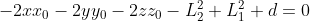

Обозначим 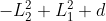 за D. В итоге получим уравнение плоскости вида:

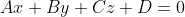,

где  ,  ,  соответственно.

Вообще пересечением сфер является окружность, но так как сложно описать уравнение окружности, произвольно лежащей в пространстве, мы получили уравнение плоскости, в которой лежит нужная нам окружность. Так как из всей плоксоти нам нужны конкретные точки, а именно лежащие на сфере, мы должны совместно решить уравнение плоскости и уравнение какой-нибудь из сфер(возьмём первое для удобства)(кстати, система из уравнения плоскости и сферы как раз даёт уравнение окружности произвольно ориентированной в пространстве), также вспомним, что мы опустили условие, что звено L1 может двигаться только в плоскости, поэтому сразу добавим третьим уравнением - уравнение плоскости L1, так как этой плоскостью является XY, то её уравнением будет просто z = 0. В итоге получим:

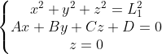

Можем сразу подставить z=0 в два другим уравнения и получим:

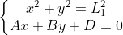

Из второго уравнения выразим x:

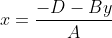

и подставим это в первое уравнение:

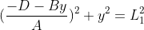

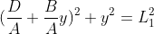

###

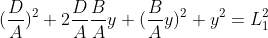

###

###

Отсюда можно найти решение - координату локтя:

А по формулам полученным выше можно найти вторую координату:

или если нужно избежать возможное деление на ноль

Зная координаты локтя, можно найти угол поворота первого звена, как:

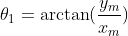

Для нахождения угла  вспоним сначала, что это поворот плоскости манипулятора вокруг первого звена, значит нахождения этого угла можно поставить как задачу расчёта угла между плоскостями: исходной(XY) и новой(желаемой), которые имеют общую прямую пересечения(которая проходит через первое звено). Плоскость можно задавать с помощью координат нормали к этой плоскости. Для исходной плоскости это будет единичный вектор сонаправленный с осью Z. Для получения уравнения координат нормали к новой плоскости, построим сначала уравнение самой плоскости. Для этого используем уравнение:

где вертикальные черты означают определитель,  - координаты трёх точек, по которым строится плоскость. В качестве трёх точек возьмём начало координат, координаты локтя, желаемую точку, в итоге получим уравнение желамеой плоскости манипулятора:

коэффициенты при переменных - и будут координатами нормали к данной плоскости. Тогда мы можем воспользоваться формулой косинуса угла между пересекающимеся плоскостями по координатам их нормали:

так как нам важен знак(четверть угла), то воспользуемся формулой:

Подставляя координаты наших нормалей получим:

Из-за громоздкости выражений и расчётов был использован скрипт для символьных выражений [Ang_plosk.m](Script/Ang_plosk.m), который выводит выражения выше. От арккосинуса перейдём к арктангенсу, так как он позволяет сократить выражение, а также имеет специлизированные функции, защищающие от случай деления на ноль. Для этого сделаем преобразование:

Используем выражение:

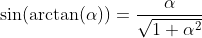

Для этого сделаем преобразование:

минус в одной из скобок знаменателя был добавлен так как дробь стоит под квадратом, а в знаменателе корень, который не меняет знака

С учётом всех вышеперечисленных выражений, получим:

или

Для нахождения угла  достаточно знать, что он всегда лежит в плоскости манипулятора, а значит для его нахождения можно рассмотреть манипулятор как плоскую фигуру. Построим:

нужный нам угол составляет с углом  180 градусов. Угол  мы можем найти из теоремы косинусов:

###

Тогда с заменой  на  получим:

###
Для проверки работоспособности можно воспользоваться скриптом [Proverka.m](Script/Proverka.m)