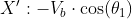
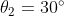

Обозначения и значения параметров

Значение параметров взяты [отсюда](https://github.com/lsd-maddrive/mishanya-bot-project/blob/develop/docs/kinematics/dimensions.md)

| Обозначение| Смысл| Значение, ед. изм.|
| -------------------|:---------------:| ---------:|
| *XY*      | абсолютная система координат | м |
| *X'Y'*      | связанная система координат      |   м |
|  | угол поворота основания      |    рад |
|       | угловая скорость основания | рад/с |
| *L*      | радиус основания | 0.40643 м |
|      | линейные скорости основания в абсолютной системе | м/с |
||линейные скорости омниколёс|м/с|
||угловые скорости омниколёс|рад/с|
|*r*|радиус омниколёс|0.061 м|

###
Прямая кинематика:

Обратная кинематика:

###

Вывод уравнений

Для вывода уравнений прямой кинематики сначала найдём преобразование из абсолютной системы координат(XY) в систему координат, связанную с платформой(X'Y'). Преобразование это из себя представляет поворот системы координат на угол поворота самой платформы - . Исходную систему и повёрнутую связывает простая матрицы поворота:

######

Такая же матрица поворота будет связывать проекции скоростей в своих системах координат:

Для уравнений прямой кинематики нам нужно связать скорости платформы с угловыми скоростями омниколёс. Так как рассматриваем мы линейные скорости, то нужно сначала получить линейные скорости, с которым колесо будет "катиться" при заданной угловой. Путь, пройденный колесом, равен длине дуги, которая опирается на угол, на который повернулось колесо, в силу их "соприкосновения" (в отсутствии скольжения). Длина дуги связана с углом поворота через радиус колеса, поэтому и линейная с угловой скорости тоже будут связаны через радиус:

Данное выражение для угловой скорости, выраженной в рад/с. Чтобы использовать скорость, выраженной в  нужно домножить правую часть на . Теперь зная это мы можем спокойной работать пока с линейными скоростями, так как они линейно связаны с угловыми.

Теперь выразим линейные скорости платформы через проекции скоростей колёс на оси связанной системы координат. Пусть линейная скорость одного из колёс всегда соноправлена с одной из осей(в нашем случае - скорость колеса `a` с осью X'). Тогда вектор скорости колеса `b` будет отстоять от оси X'(если точнос - от -X') на угол (или ), что не сложно рассчитать, если учитывать, что угол между осями колёс = . Значит проекции скорости колеса `b` по осям будут соответственно:

Вектор скорости колеса `с` будет отстоять от оси Y'(от -Y') на угол (или ). Его проекции по осям будут соответсвенно:

Чтобы получить результирующую скорость по каждой из осей - просто сложим проекции по соответсвующим осям:

Данные уравнения можно представить в матричной форме:

Теперь нам нужно вернуться в исходную систему координат. Так как у нас тут по сути последовательное применение линейных преобразований, мы можем просто перемножить матрицы в нужном порядке:

Видно, что некоторые компоненты полученной матрицы представляют из себя по сути формулы косинуса/синуса суммы/разницы. Упростив эти компоненты по соответствующим правилам получим в итоге:

То есть связь для линейных скоростей:

Для полного набора переменных, характеризующих движение платформы нам также нужна её угловая скорость. Для её расчёта на не нужны геометрические преобразования, так как она явно зависит от скоростей колёс. По аналогии с рассуждениями о линейной и угловой скорости колеса, угловая скорость платформы равна линейной скорости на расстоянии радиуса умноженной на этот радиус. Скоростей у нас три, поэтому угловая скорость будет равна сумме составляющих по каждой из них:

Это уравнение мы спокойно можем добавить в общую систему, так как она линейно зависит от скоростей:

Чтобы система всё же была выражена через угловые скорости колёс, вынесем радиус колеса из вектора линейных скоростей(радиус всех колёс предпологается одинаковым):

Теперь достаточно подставить чиленные значения углов и получить нашу систему.

Для расчёта обратной кинематики можно проделать похожие рассуждения но "в обратную сторону". Но проще поступить иначе. Так как прямая кинематика - это по сути линейное преобразование, то чтобы получить обратную - нужно в уравнениях прямой кинематики домножить правую и левую части на обратную матрицу преобразования. Но так как у нас по сути преобразование только вращения и нет смещения(нет явно выраженного слагаемого и матрица не соответствует форме однородного преобразования), то обратная матрица будет равна транспонированной матрице. Единственное что к масштабирующему коэффициенту нужно будет взять обратное значение, так как преобразование вращение и обратное к ней взаимны без маштабирования. Отсюда получаем:

Окончательно:

